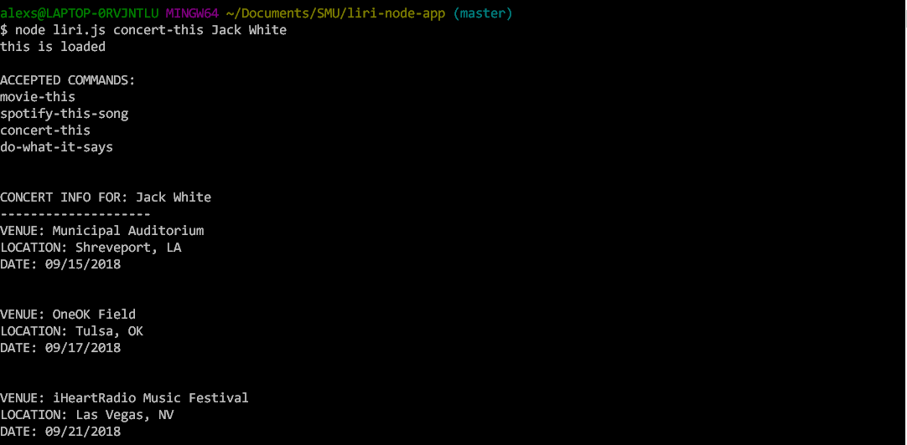
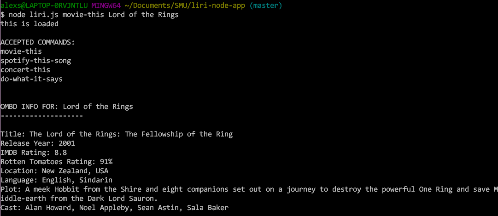
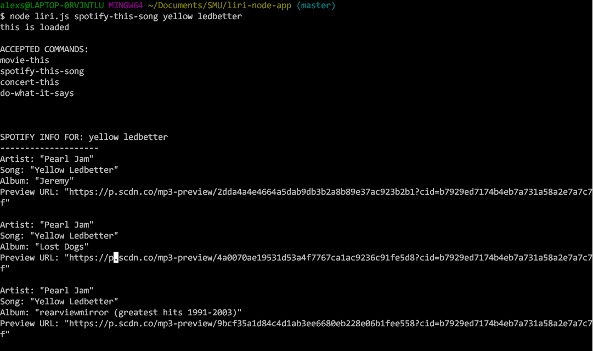
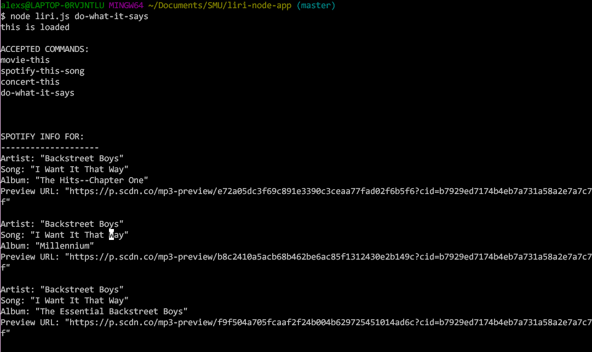

# liri-node-app

LIRI — Language Interpretation and Recognition Interface — is a node-powered command-line app that acts as a personal assistant. It can return information on movies, concerts, and songs by retrieving data from OMDB, Bandsintown, and Spotify (respectively).
Commands: concert-this, movie-this, spotify-this-song, do-what-it-says

### concert-this
This command searches the Bandsintown API for event info based on your search term. If no search term is provided, it shows info for Jack White concerts.

### movie-this
This command searches the OMDB API for info and ratings data based on your search term. If no search term is provided, it shows info for Die Hard. 

### spotify-this-song
This command searches Spotify for song info based on your search term. If no term is provided, it returns info for Nothing Else Matters.

### do-what-it-says
This command reads info from a txt file and uses the contained text to perform a command.
.
